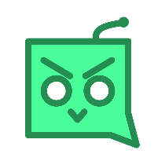
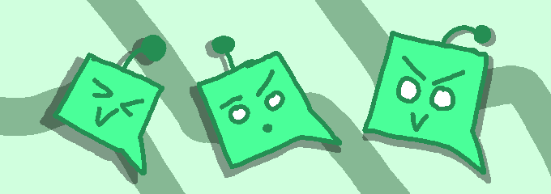

# CoolBot
A fun little Discord bot.

# Description
CoolBot is a simple bot made for small Discord servers that provides a grab-bag of modules to use.

## Modules
* **Debt** [`/fine`, `/getdebts`, `/pay`] - Give your friends debt! Fun for jokes or to keep accountability in your server. Whatever you do, don't try to fine CoolBot!
* **Roles** [`/role`] - Give yourself a nice role color via hex color codes!
* **Craft** [`/join`] - Whitelist yourself on an external Minecraft server!
* **Ask** [`/ask`] - Seek CoolBot's magic 8-ball wisdom for your questions!

# Building and Usage
CoolBot is made with .NET 10 and the NetCord NuGet package.

First, go on the Discord Developer Portal and create a new application. Get the bot token and invite it to your server. Inside the server, the bot's role should be one of the highest positions in the hiearchy in order for some modules to work.

Then you can clone the repository and inside the cloned folder, create an `appsettings.json` file with these contents:
```
{
  "Discord": {
    "Token": "PUT YOUR BOT TOKEN HERE"
  }
}
```

After creating the file, simply run `dotnet run`, which will gather all the dependencies, build the project, and run the bot.

The bot uses SQLite to store some persistent data for some modules, and its database is stored in the bot's working directory as `CoolBot.db`.

Hope you enjoy this fun little bot!



